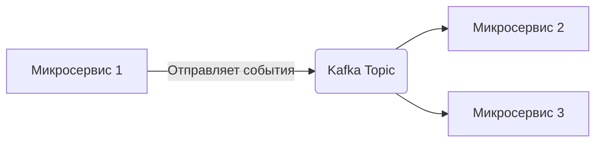

# Архитектура интеграции Kafka

## Компоненты

- **Producer**: Отправляет сообщения в Kafka топик. Реализован в `internal/kafka/producer.go`.
- **Consumer**: Слушает топик и обрабатывает сообщения. Реализован в `internal/kafka/consumer.go`.
- **ProducerPool**: Пул производителей для эффективной отправки сообщений (если используется).

## Поток данных

1. Микросервис 1 генерирует событие (например, создание заказа).
2. Producer отправляет событие в соответствующий топик Kafka.
3. Consumer в Микросервисе 2 и Микросервисе 3 получают событие и обрабатывают его асинхронно.

## Преимущества

- **Асинхронность**: Микросервисы не зависят от скорости работы друг друга.
- **Масштабируемость**: Можно увеличивать количество консьюмеров для обработки пиковых нагрузок.
- **Надежность**: Kafka гарантирует доставку сообщений.
